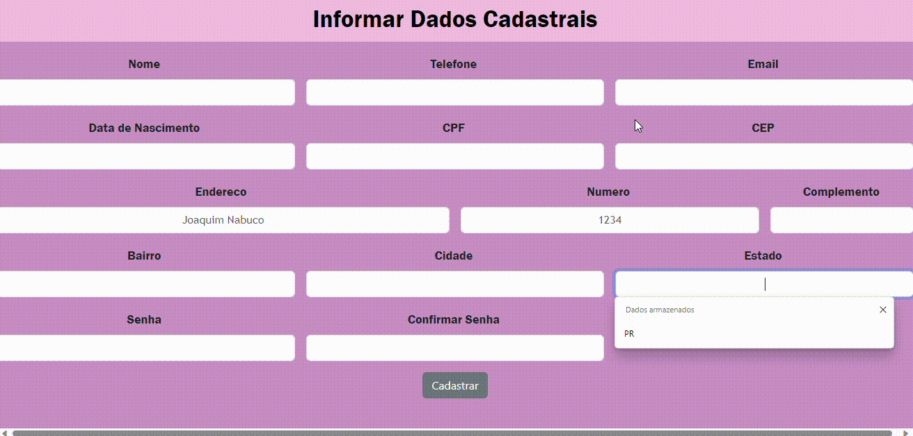

# Descrição Geral
Utilizei o codigo antigo do formcadastro e adicionei no novo repositorio, criei um repositorio no gihthub para esse projeto, estilizei o css, alterei o cep para ele funcionar, adicionei mais campos de preenchimento, como informaçoes pessoais, pesquisei 3 sites para compara-los através de pesquisas. Ele tambem é responsivo se adapta a qualquer aparelho.  

## Fontes consultadas 
* Tems
* VScode
* Gihthub
* Sites

## Os sites de E-commerc utilizados
Esses sites foram utilizados para uma comparação entre eles, atrav~es de pesquisas
* [Americanas](https://www.americanas.com.br/)
* [Shopee](https://shopee.com.br/?gad_source=1&gclid=CjwKCAjwv-2pBhB-EiwAtsQZFC047vh6sRD9NUkH_7eYviXflgsfxEBefsxhkVqxsca0-umqYwb6IhoCRG0QAvD_BwE)
* [Magazine](https://www.magazineluiza.com.br/?partner_id=974&gad_source=1&dc_eps=AHas8cBExas2AJxBFmiwfjIuWzm2iVYeCyW57NbX9d57jQc9qL8YeiZswXWgWaF2o_Wv2sBMjtiprmw&gclid=CjwKCAjwv-2pBhB-EiwAtsQZFLoNMpgHx843qZlJnU0o4hGxuWEJ5vyX-W0tUeqtILEhsyQJAtokkhoCfYQQAvD_BwE&gclsrc=aw.ds)

### Similaridades e Divergências entre os formulários
**Similaridades**
 Nos sites percebi que as caracteristicas similares são que na pagina inicial todos tem algums produtos a amostra 
 o site da americanas e magazine eles sao mais organizados e design é bonito.
**Divergências**
o site da shoppe nao tem um design agradavel, e nao é voltado para a experiencia do usuário.

**Processso de cadastro**
`Shoppe` O cadastro é no processo final da compra ou na pagina inicial voce escolhe, nele pede informaçoes pessoais como nome, endereço, telefone e outros. 
``Americanas`e `Magazine` Tem a opção de você inserir o CEP na pagina inicial para calcular melhor os fretes e prazos da para sua região.
obs:Os três sao bem parecidos sao minimos detalhes que mudam que foram citados, entre outros.

###  recursos implementados no formulario
- Adicionei campos de preenchimento como email, nome, senha, sobrenome, data de nascimento.
- adicionei o arquivo css pois nao tinha.
- adicionei background no meu formulario, posicionei tudo alinhado .

## Autor
[Amanda](https://github.com/amandvitoria)  
**Contribuidores do projeto**  
[Larissa](https://github.com/larissassk)  
[Emilly](https://github.com/emillycaaroline)  